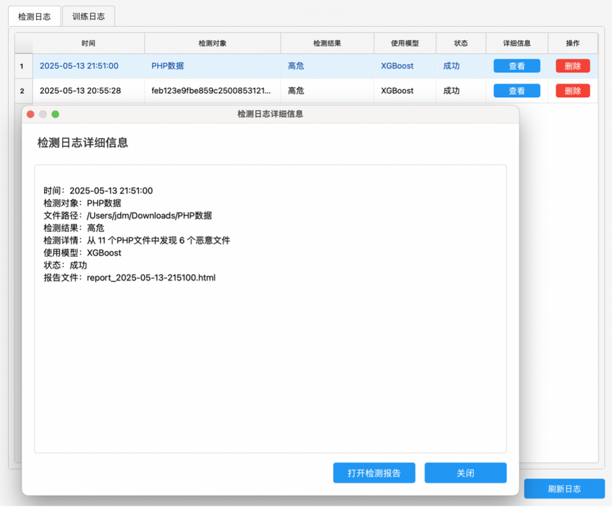

# ML-WebshellDetect: Machine-Learning-based PHP WebShell Detection

A GUI-based PHP WebShell detection system using opcode-level feature extraction and machine learning.

This project was developed as my undergraduate thesis project in Information Security. It focuses on static detection of PHP WebShell files by converting PHP source code into opcode sequences, constructing N-Gram and TF-IDF feature representations, and training classical machine learning classifiers for malicious-code classification.

## Overview

WebShells are commonly used as web backdoors in real-world cyber attacks. Traditional rule-based detection methods often struggle with obfuscated or variant WebShell samples because attackers may use encoding, code obfuscation, irrelevant code insertion, function hiding, or other evasion techniques.

This project explores a machine-learning-based approach for PHP WebShell detection. Instead of relying only on manually written signatures, the system extracts opcode-level representations from PHP files and trains classifiers to distinguish malicious WebShell files from benign PHP files.

The system provides a PyQt5-based graphical user interface and supports dataset preprocessing, model training, model management, single-file detection, batch directory scanning, HTML report generation, malicious-file deletion, and log management.

## Key Features

* **PHP WebShell static detection**

  * Detects potentially malicious PHP WebShell files without executing them.

* **Opcode-level feature extraction**

  * Uses PHP VLD to convert PHP files into opcode sequences.

* **N-Gram and TF-IDF feature engineering**

  * Builds 2–4 gram opcode representations with `CountVectorizer`.
  * Converts opcode frequency features into TF-IDF feature vectors.

* **Multiple machine learning classifiers**

  * Supports XGBoost, Random Forest, Linear SVM, Naive Bayes, and Decision Tree classifiers.

* **Hyperparameter tuning**

  * Uses `GridSearchCV` with F1-weighted scoring for model selection and tuning.

* **GUI-based workflow**

  * Provides a PyQt5 interface for preprocessing, training, model management, detection, reports, and logs.

* **Single-file and batch detection**

  * Supports detecting one PHP file or scanning a directory recursively.

* **Model and feature extractor management**

  * Saves trained models, feature extractors, TF-IDF matrices, labels, and model metadata.

* **Reports and logs**

  * Generates detection reports and records training/detection logs for traceability.

## Methodology

The detection pipeline follows the workflow below:

```text
PHP files
→ PHP syntax validation
→ Opcode extraction with PHP VLD
→ Opcode sequence parsing
→ 2–4 gram CountVectorizer representation
→ TF-IDF transformation
→ Machine learning classifier training
→ Model evaluation and saving
→ Single-file or directory-based detection
→ Report generation and logging
```

### 1. PHP Opcode Extraction

The system uses PHP VLD to extract opcode sequences from PHP files. Internally, the extraction process calls commands similar to:

```bash
php -dvld.active=1 -dvld.execute=0 -dvld.dump_paths=0 -f sample.php
```

The extracted opcode tokens are then parsed and joined into opcode sequences for feature construction.

### 2. Feature Representation

The opcode sequences are transformed into machine-learning features through:

* `CountVectorizer`
* 2–4 gram opcode features
* TF-IDF transformation

This allows the system to represent PHP files as numerical feature vectors while preserving local opcode sequence patterns.

### 3. Model Training

The system supports the following classifiers:

* XGBoost
* Random Forest
* Linear SVM
* Naive Bayes
* Decision Tree

During training, the dataset is split into training and test sets. `GridSearchCV` is used for hyperparameter tuning, and models are evaluated using:

* Accuracy
* Precision
* Recall
* F1-score

The trained model and feature extractors are saved for later detection.

### 4. Detection

For detection, the system loads the selected trained model and the corresponding feature extractors. It then extracts opcode sequences from the target PHP file or directory, transforms them into TF-IDF features, and predicts whether each file is benign or malicious.

## Screenshots

### Data Preprocessing


The preprocessing module supports malicious/benign PHP sample selection, output directory selection, PHP syntax validation, MD5-based sample normalization, and preprocessing logs.

### Model Training


The training module supports dataset selection, model selection, progress monitoring, real-time training logs, and training result display.

### Model Management


The model management module displays trained model versions, evaluation metrics, dataset information, active model selection, and model deletion actions.

### WebShell Detection


The detection module supports single-file detection and batch directory scanning. The system extracts opcode sequences from PHP files, transforms them into TF-IDF features, and predicts whether each file is benign or malicious.

### HTML Detection Report


The system can generate an HTML detection report after scanning, summarizing scanned files, detected high-risk files, and detailed detection results.

### Logs



The system records preprocessing, training, and detection logs, making it easier to trace experiments, review detection history, and manage model outputs.

## Project Structure

```text
ML-WebshellDetect/
├── Controller/              # GUI controllers and workflow coordination
├── Data/                    # Data-related resources and runtime files
├── Model/                   # Database and model-related modules
├── Utils/                   # Core preprocessing, training, and detection utilities
├── View/                    # PyQt5 GUI pages and UI components
├── screenshots/             # README screenshots
├── main.py                  # Application entry point
└── README.md
```

The project follows an MVC-style architecture. The GUI layer handles user interaction, the controller layer coordinates workflows, and the model/service logic manages preprocessing, feature extraction, machine learning training, detection, logging, and model management.

## Installation

### 1. Clone the repository

```bash
git clone https://github.com/Hongbin10/ML-WebshellDetect.git
cd ML-WebshellDetect
```

If your repository name is different, replace the URL and folder name with the actual repository path.

### 2. Create a Python environment

Python 3.8+ is recommended.

```bash
python -m venv venv
source venv/bin/activate      # macOS / Linux
# venv\Scripts\activate       # Windows
```

### 3. Install Python dependencies

```bash
pip install pyqt5 scikit-learn xgboost joblib rich numpy scipy pandas
```

Depending on your local environment, some dependencies may already be installed.

### 4. Install PHP

This project requires PHP because PHP files are parsed through PHP command-line tools.

Check whether PHP is installed:

```bash
php -v
```

### 5. Install PHP VLD

This project relies on PHP VLD to extract opcode sequences from PHP files.

Check whether VLD is available:

```bash
php -m | grep vld
```

If VLD is not installed, install the PHP VLD extension according to your operating system and PHP version.

The opcode extraction module expects PHP VLD commands such as the following to work:

```bash
php -dvld.active=1 -dvld.execute=0 -dvld.dump_paths=0 -f sample.php
```

### 6. Run the application

```bash
python main.py
```

## Usage

### 1. Prepare datasets

Prepare two folders containing PHP files:

```text
dataset/
├── malicious/     # PHP WebShell samples
└── benign/        # benign PHP files
```

The dataset should contain valid `.php` files. During preprocessing, the system checks PHP syntax and normalizes sample filenames using MD5 hashes.

### 2. Preprocess datasets

In the GUI, select:

* malicious sample directory;
* benign sample directory;
* output directory.

The preprocessing module will:

* recursively collect `.php` files;
* check PHP syntax with `php -l`;
* normalize filenames using MD5 hashes;
* copy valid samples into clean output folders;
* display progress and logs in the GUI.

### 3. Train a model

After preprocessing, open the model training page and select a classifier.

Supported classifiers include:

* XGBoost
* Random Forest
* Decision Tree
* Linear SVM
* Naive Bayes

The training pipeline will:

* extract opcode sequences with PHP VLD;
* construct 2–4 gram opcode features;
* transform features using TF-IDF;
* tune hyperparameters with GridSearchCV;
* evaluate the model using accuracy, precision, recall, and F1-score;
* save the trained model and feature extractors.

### 4. Manage models

The model management page allows users to:

* view trained models;
* compare model metrics;
* select the active detection model;
* delete unused models.

### 5. Detect PHP files

The detection page supports:

* single PHP file detection;
* batch directory scanning.

The system extracts opcode sequences from the selected PHP files, transforms them into TF-IDF features, and predicts whether each file is benign or malicious.

### 6. Review reports and logs

After detection, the system can:

* display detection results in the GUI;
* generate HTML detection reports;
* record detection logs;
* record training logs;
* optionally delete detected high-risk files.

## Example Workflow

```text
1. Prepare malicious and benign PHP datasets
2. Preprocess datasets in the GUI
3. Train a classifier such as XGBoost or Random Forest
4. Select the trained model in the model management page
5. Run single-file or directory-based detection
6. Review detection results, reports, and logs
```

## Technical Details

### Opcode Extraction

PHP VLD is used to extract opcode sequences from PHP files. These opcode sequences provide a lower-level representation than raw source code and can reduce dependence on surface-level lexical patterns.

### Feature Engineering

The system uses opcode N-Gram features and TF-IDF weighting:

```text
Opcode sequence → CountVectorizer 2–4 gram features → TF-IDF matrix
```

This feature representation captures local opcode patterns that may be useful for distinguishing WebShell files from benign PHP files.

### Classifier Training

The training module supports multiple classical machine learning algorithms. Hyperparameter tuning is performed using `GridSearchCV`, and weighted F1-score is used as the optimization metric.

### Model Versioning

The system saves trained models and their metadata, including model type, version, evaluation metrics, training time, and model path. This allows users to manage and compare different detection models.

## Limitations

This project is a classical machine-learning-based static detection prototype. It focuses on opcode-level N-Gram and TF-IDF features rather than deeper program semantics, data-flow analysis, taint analysis, or LLM-based code reasoning.

The current system is mainly designed for PHP WebShell detection and may not generalize directly to WebShells written in other languages without modifying the feature extraction pipeline.

Detection performance may depend on the quality, diversity, and scale of the training dataset. Heavily obfuscated or novel WebShell variants may still be challenging for static opcode-based models.

## Future Work

Future work could extend this prototype in several directions:

* adding robustness evaluation against obfuscated WebShell variants;
* incorporating program-analysis-inspired features such as data-flow or taint-style representations;
* exploring deep learning or transformer-based code representations;
* integrating LLM-assisted code understanding for suspicious PHP script analysis;
* extending the system to other WebShell languages such as ASP, JSP, or Python;
* improving dataset construction and evaluation on larger real-world samples.

## Thesis Context

This project was developed as an undergraduate thesis project:

**Design and Implementation of WebShell Detection System Based on Machine Learning**
BEng Information Security, Changchun University of Technology, 2025

The project combines cybersecurity, malicious-code detection, feature engineering, machine learning, and GUI-based system development.

## Disclaimer

This project is intended for academic research and defensive security purposes only. It should only be used on files, systems, and datasets for which the user has proper authorization.
