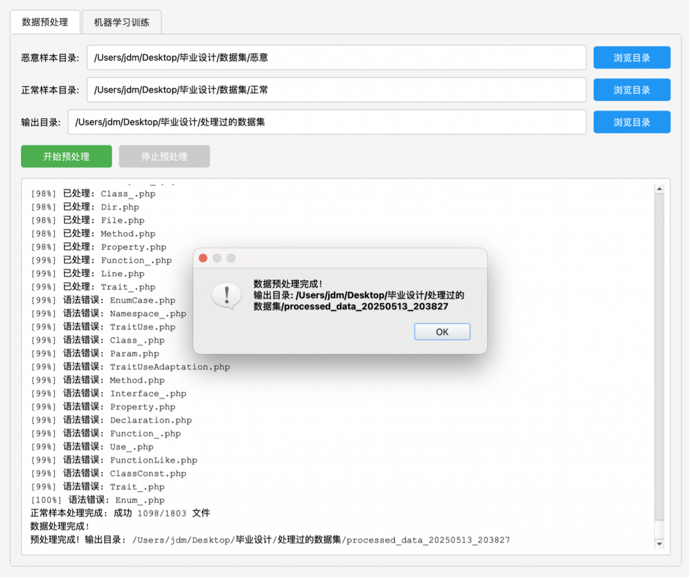
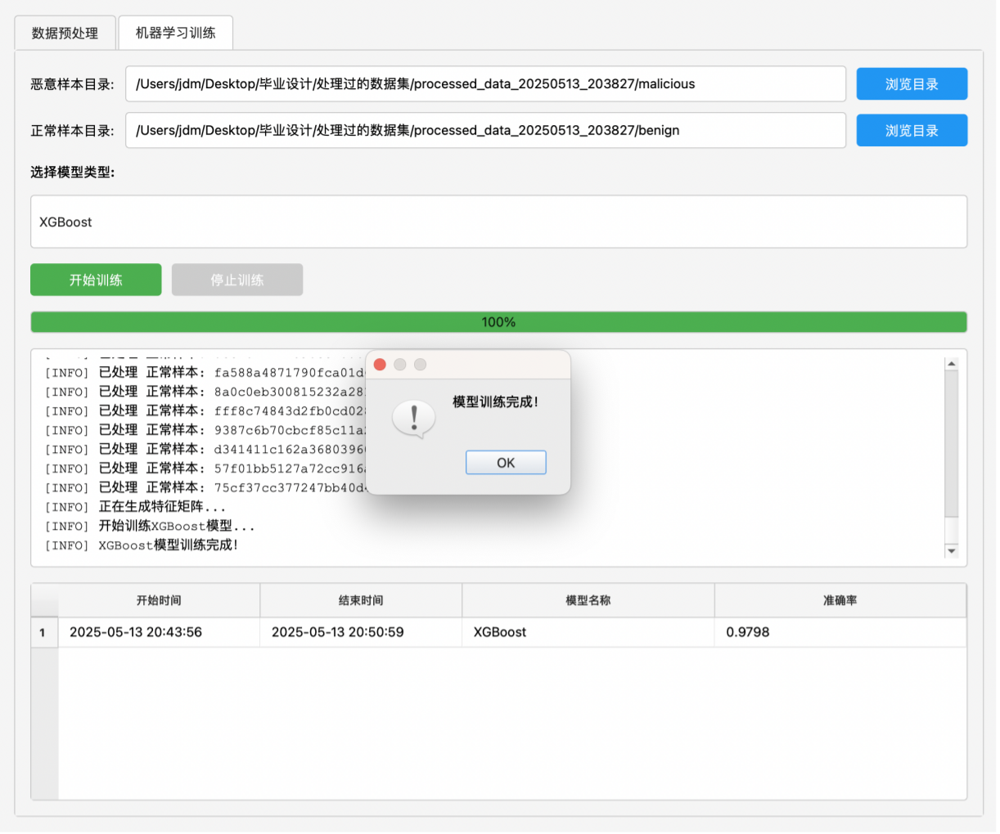
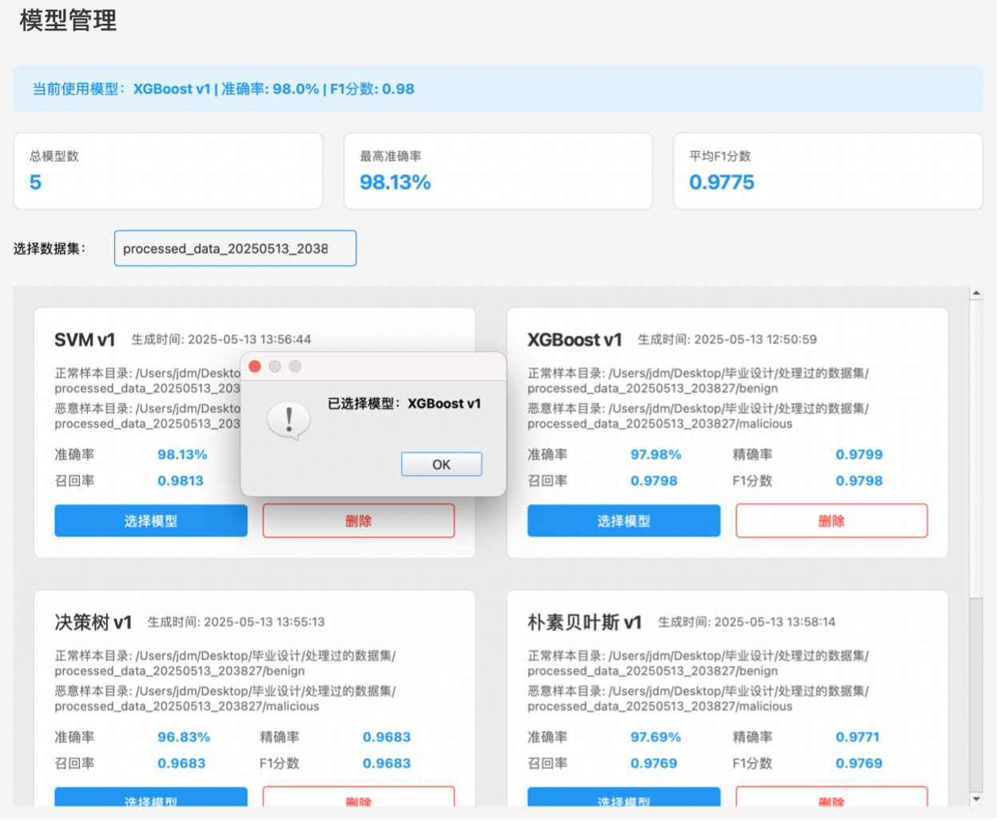
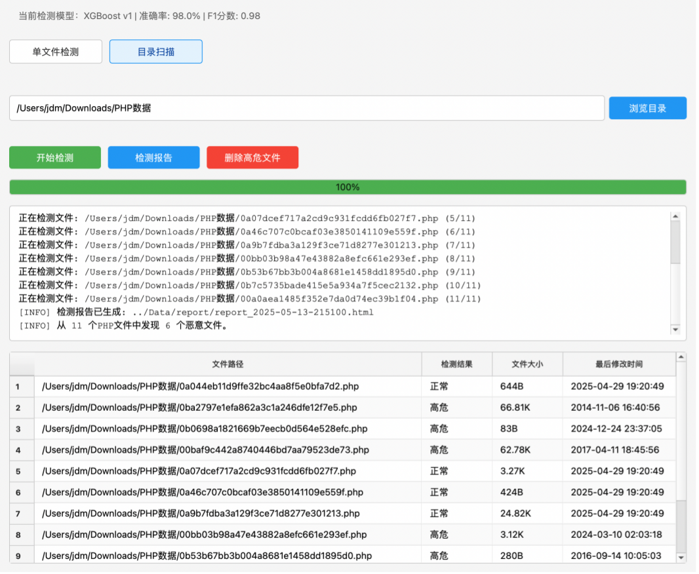
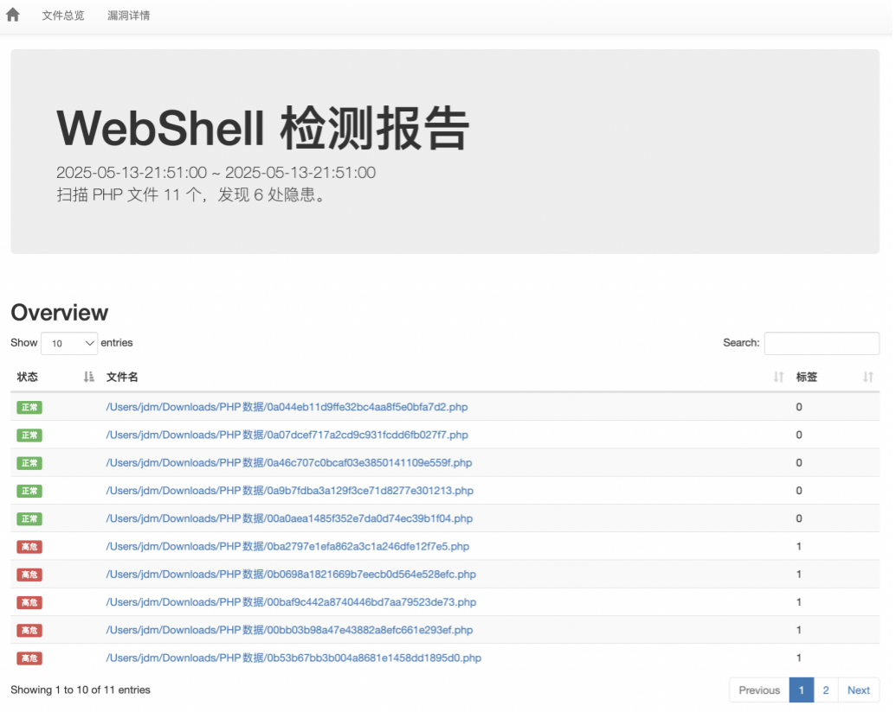

## Project Structure

```text
ML-WebshellDetect/
├── Controller/              # GUI controllers and interaction logic
├── Data/                    # Data-related resources and runtime files
├── Model/                   # Database and model-related modules
├── Utils/                   # Core utility functions for preprocessing, training, and detection
├── View/                    # PyQt5 GUI pages and UI components
├── main.py                  # Application entry point
└── README.md
```

The project follows an MVC-style architecture. The GUI layer handles user interaction, the controller layer coordinates workflows, and the model/service logic manages preprocessing, feature extraction, machine learning training, detection, logging, and model management.

## Installation

### 1. Clone the repository

```bash
git clone https://github.com/Hongbin10/ML-WebshellDetect.git
cd ML-WebshellDetect
```

### 2. Create a Python environment

Python 3.8+ is recommended.

```bash
python -m venv venv
source venv/bin/activate      # macOS / Linux
# venv\Scripts\activate       # Windows
```

### 3. Install Python dependencies

```bash
pip install pyqt5 scikit-learn xgboost joblib rich
```

Depending on your local environment, you may also need:

```bash
pip install numpy scipy pandas
```

### 4. Install PHP and PHP VLD

This project relies on PHP VLD to convert PHP files into opcode sequences.

Check whether PHP is installed:

```bash
php -v
```

Check whether VLD is available:

```bash
php -m | grep vld
```

The opcode extraction pipeline internally calls commands similar to:

```bash
php -dvld.active=1 -dvld.execute=0 -dvld.dump_paths=0 -f sample.php
```

If VLD is not installed, install the PHP VLD extension according to your operating system and PHP version.

### 5. Run the application

```bash
python main.py
```

## Usage

### 1. Preprocess datasets

Prepare two folders:

```text
dataset/
├── malicious/     # PHP WebShell samples
└── benign/        # benign PHP files
```

In the GUI, select the malicious and benign sample directories, then run preprocessing.

The preprocessing module will:

* recursively collect valid `.php` files;
* check PHP syntax with `php -l`;
* normalize filenames using MD5 hashes;
* copy processed files into clean output folders;
* report progress through the GUI.

### 2. Train machine learning models

After preprocessing, select a model type in the training page.

Supported classifiers include:

* XGBoost
* Random Forest
* Decision Tree
* Linear SVM
* Naive Bayes

The training pipeline will:

* extract PHP opcode sequences using VLD;
* construct 2--4 gram opcode features using CountVectorizer;
* transform feature vectors with TF-IDF;
* train and tune classifiers with GridSearchCV;
* evaluate models using accuracy, precision, recall, and F1-score;
* save trained models and feature extractors for later detection.

### 3. Manage trained models

The model management page allows users to:

* view trained models;
* compare model metrics;
* select the active detection model;
* delete unused models.

### 4. Detect PHP WebShell files

The detection module supports both:

* single-file detection;
* batch directory scanning.

For each PHP file, the system extracts opcode sequences, transforms them into TF-IDF features using the saved feature extractor, and predicts whether the file is benign or malicious using the selected machine learning model.

### 5. Generate reports and handle malicious files

After detection, the system can:

* display detection results in the GUI;
* generate detection logs;
* generate HTML detection reports;
* optionally delete detected high-risk files.

## Screenshots

> Suggested screenshot files should be placed under a `screenshots/` folder.

### Data Preprocessing

```markdown

```

Shows the dataset preprocessing workflow, including malicious/benign sample directory selection, output directory selection, progress display, and preprocessing logs.

### Model Training

```markdown

```

Shows the machine learning training page, including model selection, training progress, real-time logs, and training result display.

### Model Management

```markdown

```

Shows trained model versions, evaluation metrics, active model selection, and model deletion.

### WebShell Detection

```markdown

```

Shows single-file or directory-based WebShell detection, prediction results, and high-risk file handling.

### Detection Report

```markdown

```

Shows the generated HTML detection report, including scanned files, detected malicious files, and summary statistics.
